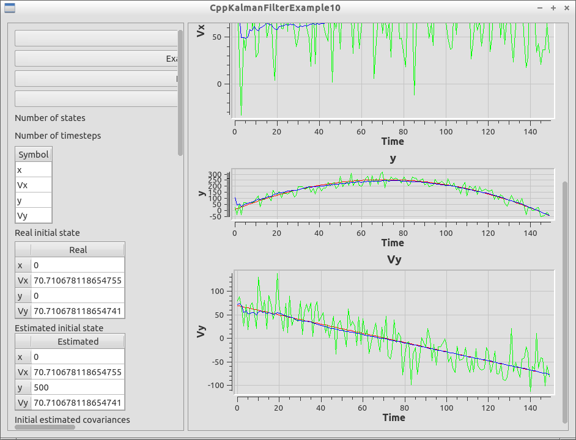

# KalmanFilterExample10

[Kalman filterer example](https://github.com/richelbilderbeek/KalmanFilterExample) 10 is an example to use a Kalman filter.

# External links

 * [KalmanFilterer](https://github.com/richelbilderbeek/KalmanFilterer): tool to explore and work with Kalman filters
